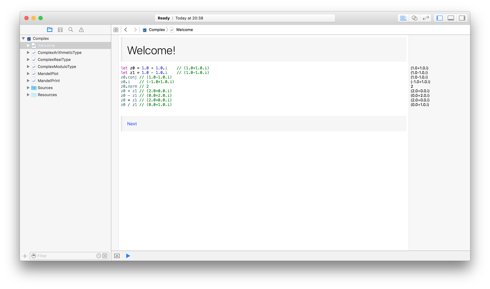
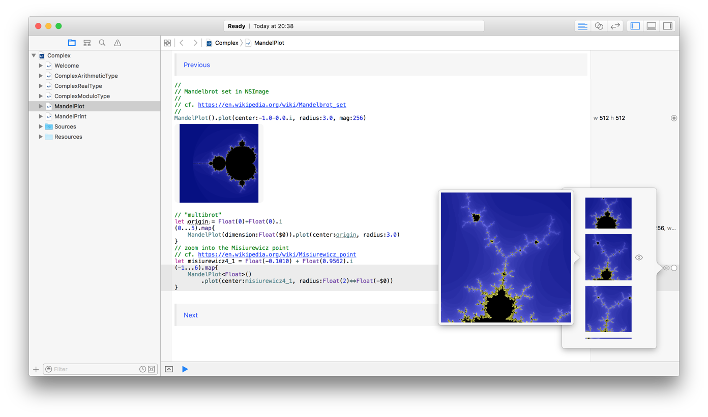
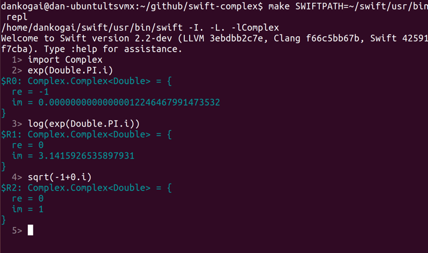

[](http://travis-ci.org/dankogai/swift-complex)

swift-complex
=============

Complex numbers in [Swift].

[Swift]: https://developer.apple.com/swift/

Prerequisite
------------

Swift 2.0 or better, OS X or Linux.

For Swift 1.x and below see the swift-1.x branch 
(which is no longer maintained).

Usage
-----

### in your project:

Just add [complex/complex.swift] to it.

To use `**` and `=~` operators, add [complex/exops.swift] as well.

[complex/complex.swift]: ./complex/complex.swift
[complex/exops.swift]: ./complex/exops.swift

### with playground

Have fun with [Complex.playground] that is a part of this git repo.





[Complex.playground]: ./Complex.playground

When you use it, make sure you turn on the left pane (it's off right after you pulled since UI settings are `.gitignore`d).  As you see above, this playground consists of multiple pages and sources.

#### with your playground

Just drop [complex/complex.swift] to `Sources`.  In git `Complex.playground/Sources/complex.swift` is a symlink thereto.

To use `**` and `=~` operators, add [complex/exops.swift] as well.

### REPL via command line:



#### OS X with Xcode
````shell
git clone https://github.com/dankogai/swift-complex.git
cd swift-complex
make repl
````

#### Linux
````shell
git clone https://github.com/dankogai/swift-complex.git
cd swift-complex
make SWIFTPATH=${YOUR_SWIFT_PATH} repl # ${YOUR_SWIFT_PATH}=~/swift/usr/bin in my case
````


### test via command line:

#### OS X with Xcode
````shell
git clone https://github.com/dankogai/swift-complex.git
cd swift-complex
make test
````

#### Linux
````shell
git clone https://github.com/dankogai/swift-complex.git
cd swift-complex
make SWIFTPATH=${YOUR_SWIFT_PATH} test # ${YOUR_SWIFT_PATH}=~/swift/usr/bin in my case
````

Synopsis
--------

````swift
let z0 = 1.0 + 1.0.i    // (1.0+1.0.i)
let z1 = 1.0 - 1.0.i    // (1.0-1.0.i)
z0.conj // (1.0-1.0.i)
z0.i    // (-1.0+1.0.i)
z0.norm // 2
z0 + z1 // (2.0+0.0.i)
z0 - z1 // (0.0+2.0.i)
z0 * z1 // (2.0+0.0.i)
z0 / z1 // (0.0+1.0.i)
````

Description
-----------

complex.swift implements all the functionality of [std::complex in c++11], arguably more intuitively. 

[std::complex in c++11]: http://www.cplusplus.com/reference/complex/

### like C++11

* Generic! (Since version 0.3.0. `Int` support introduced in 0.5.0)
  * Complex numbers are `Complex<T>` where `T` is a type of `.re` and `.im` that conforms to the `ArithmeticType` protocol.
  * In addition to basic arithmetic operations like `+`, `-`, `*`, `/` and `abs()`, `Complex<T:RealType>` gets `libm` functions like `exp()`, `log()`, `sin()`, `cos()`.

### unlike C++11

* Instead of defining the constant `i`, `Double` and `Complex` have a property `.i` which returns `self * Complex(0,1)` so it does not pollute the identifier `i`, too popularly used for iteration to make it a constant.
* Following functions are also provided as properties:
  * `z.real` for `real(z)`
  * `z.imag` for `imag(z)`
  * `z.abs` for `abs(z)`
  * `z.arg` for `arg(z)`
  * `z.norm` for `norm(z)`
  * `z.conj` for `conj(z)`
  * `z.proj` for `proj(z)`
* Construct a complex number via polar notation as:
  * `Complex(abs:magnitude, arg:argument)`
  * In addition to `pow()`, it comes with the `**` and `=~` operators. See [complex/exops.swift] for details.

