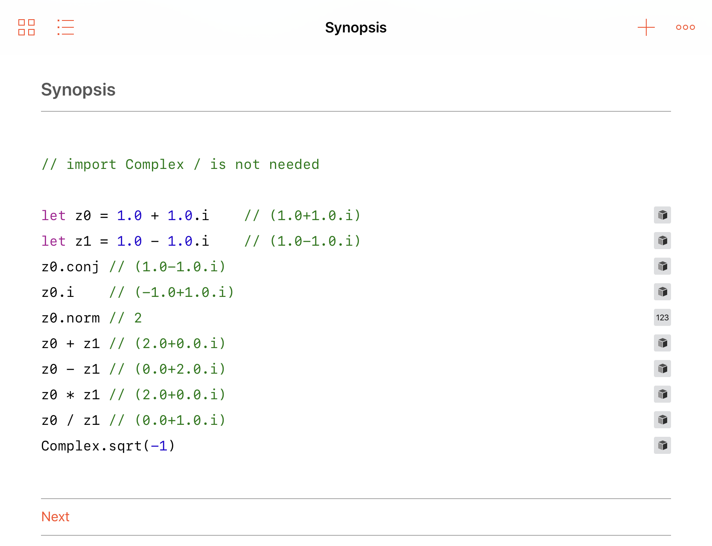

[](https://swift.org)
[](LICENSE)
[](http://travis-ci.org/dankogai/swift-complex)

# swift-complex

Complex numbers in Swift and Swift Package Manager.

## Synopsis

````swift
import Complex
let z0 = 1.0 + 1.0.i    // (1.0+1.0.i)
let z1 = 1.0 - 1.0.i    // (1.0-1.0.i)
z0.conj // (1.0-1.0.i)
z0.i    // (-1.0+1.0.i)
z0.norm // 2
z0 + z1 // (2.0+0.0.i)
z0 - z1 // (0.0+2.0.i)
z0 * z1 // (2.0+0.0.i)
z0 / z1 // (0.0+1.0.i)
````

## Description

complex.swift implements all the functionality of [std::complex in c++11], arguably more intuitively. 

[std::complex in c++11]: http://www.cplusplus.com/reference/complex/

### like C++11

* Protocol-Oriented  * Complex numbers are `Complex<R>` where `R` is a type of `.real` and `.imag` that conforms to the `ComplexElement` protocol or `GaussianIntElement` protocol.
  * In addition to basic arithmetic operations like `+`, `-`, `*`, `/` and `abs()`, `Complex<T:RealType>` gets `libm` functions like `exp()`, `log()`, `sin()`, `cos()`.

### unlike C++11

* Instead of defining the constant `i`, `Double` and `Complex` have a property `.i` which returns `self * Complex(0,1)` so it does not pollute the identifier `i`, too popularly used for iteration to make it a constant.
* Following functions are provided as compouted properties:
  * `z.abs` for `abs(z)`
  * `z.arg` for `arg(z)`
  * `z.norm` for `norm(z)`
  * `z.conj` for `conj(z)`
  * `z.proj` for `proj(z)`
* Construct a complex number via polar notation as:
  * `Complex(abs:magnitude, arg:argument)`

## Usage

### build

```sh
$ git clone https://github.com/dankogai/swift-complex.git
$ cd swift-complex # the following assumes your $PWD is here
$ swift build
```

### REPL

Simply

```sh
$ scripts/run-repl.sh
```

or

```sh
$ swift build && swift -I.build/debug -L.build/debug -lComplex

```

and in your repl,

```sh
Welcome to Apple Swift version 4.2 (swiftlang-1000.11.37.1 clang-1000.11.45.1). Type :help for assistance.
  1> import Complex
  2> Complex.sqrt(1.i)
$R0: Complex.Complex<Double> = {
  real = 0.70710678118654757
  imag = 0.70710678118654757
}
````

### Xcode

Xcode project is deliberately excluded from the repository because it should be generated via `swift package generate-xcodeproj` . For convenience, you can

```
$ scripts/prep-xcode
```

And the Workspace opens up for you with Playground on top.  The playground is written as a manual.

### iOS and Swift Playground

Unfortunately Swift Package Manager does not support iOS.  To make matters worse Swift Playgrounds does not support modules.

To address this, `scripts/makemono.pl` is provided to amalgamate all necessary sources to a single `monoComplex.swift` which can be dropped into your projects, in which case `import Complex` is unneeded.

Just run:

```shell
$ scripts/makemono.pl
```

And even more conveniently,

```shell
$ scripts/ios-prep.sh
```

Does that and adds `monoComplex.swift` into `iOS/Complex.playground`.  The resulting playground is compabile w/ the Playgrounds App for iOS.



### From Your SwiftPM-Managed Projects

Add the following to the `dependencies` section:

```swift
.package(
  url: "https://github.com/dankogai/swift-complex.git", from: "4.0.0"
)
```

and the following to the `.target` argument:

```swift
.target(
  name: "YourSwiftyPackage",
  dependencies: ["Complex"])
```

Now all you have to do is:

```swift
import Complex
```

in your code.  Enjoy!

### Prerequisite

Swift 4.2 or better, OS X or Linux to build.
