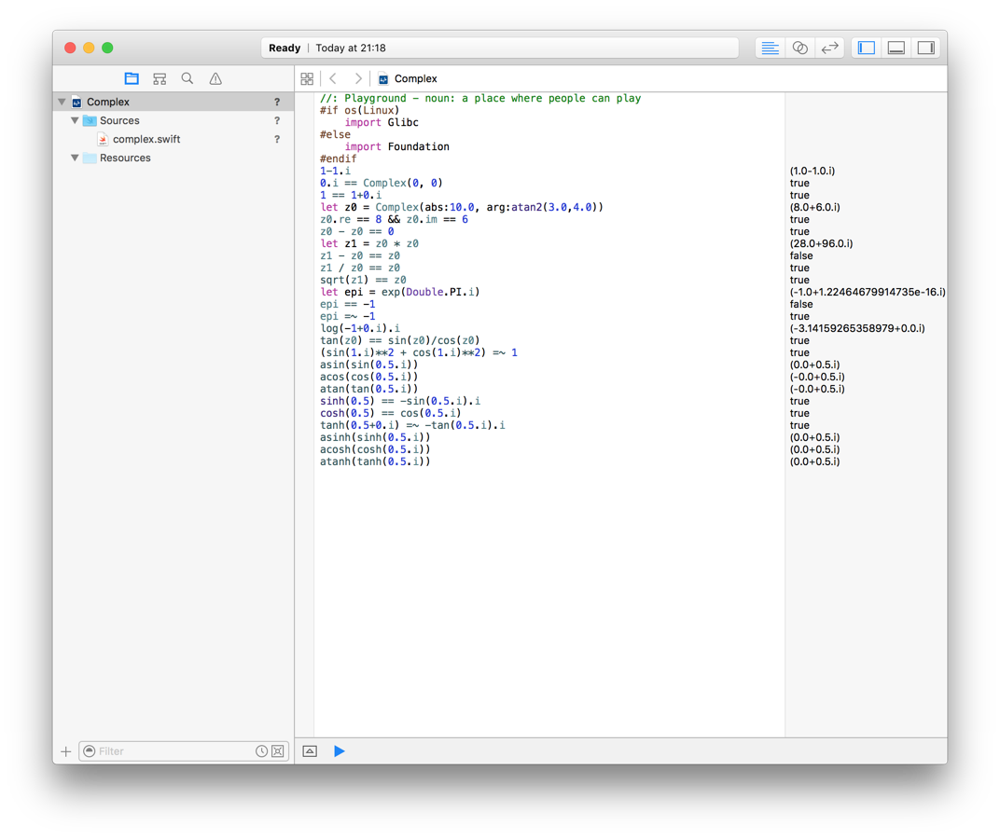

[](http://travis-ci.org/dankogai/swift-complex)

swift-complex
=============

Complex numbers in [Swift].

[Swift]: https://developer.apple.com/swift/

Prerequisite
------------

Swift 2.0 or better, OS X or Linux.

For Swift 1.x and below see the swift-1.x branch 
(which is no longer maintained).

Usage
-----

### in your project:

Just add [complex/complex.swift] to it.

[complex/complex.swift]: ./complex/complex.swift

### via command line:

#### OS X with Xcode
````shell
git clone https://github.com/dankogai/swift-complex.git
cd swift-complex/complex
xcrun -sdk macosx swiftc *.swift && ./main
# or just make test
````

#### Linux
````shell
git clone https://github.com/dankogai/swift-complex.git
cd swift-complex/complex
export SWIFTC=/path/to/your/swiftc # mine: ~/swift/usr/bin/swiftc
${SWIFTC} *.swift && ./main
# or just make BUILD=${SWIFTC} test
````

#### with playground

Just drop [complex/complex.swift] to `Sources`.



Synopsis
--------

````swift
let z0 = 1 + 1.i
let z1 = 1 - 1.i
println(z0 * z1)            // (2.0+0.0.i)
println(z0 * z1 == z0 + z1) // true
println(z0 * z1 == 2)       // true
````

Description
-----------

complex.swift implements all the functionality of [std::complex in c++11], arguably more intuitively. 


[std::complex in c++11]: http://www.cplusplus.com/reference/complex/

### Difference from C++11

* Instead of defining the constant `i`, `Double` and `Complex` have a property `.i` which returns `self * Complex(0,1)` so it does not pollute the identifier `i`, too popularly used for iteration to make it a constant.
* Following functions are also provided as properties:
  * `z.real` for `real(z)`
  * `z.imag` for `imag(z)`
  * `z.abs` for `abs(z)`
  * `z.arg` for `arg(z)`
  * `z.norm` for `norm(z)`
  * `z.conj` for `conj(z)`
  * `z.proj` for `proj(z)`
* Construct a complex number via polar notation as:
  * `Complex(abs:magnitude, arg:argument)`
* In addition to `pow()`, it comes with the `**` operator
* Generic! (as of version 0.3.0)
  * Complex numbers are `Complex<T>` where `T` is a type of `.re` and `.im` that conforms to the `RealType` protocol.  See the source to find what `RealType` is doing.
